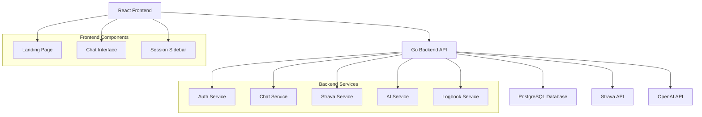
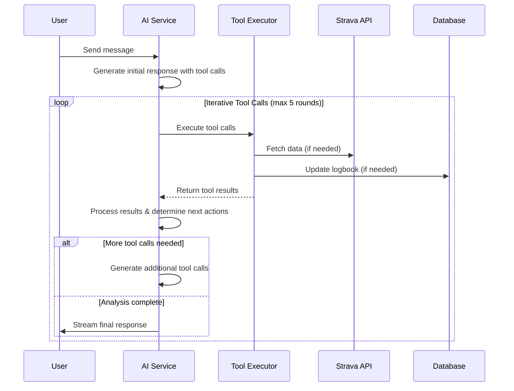
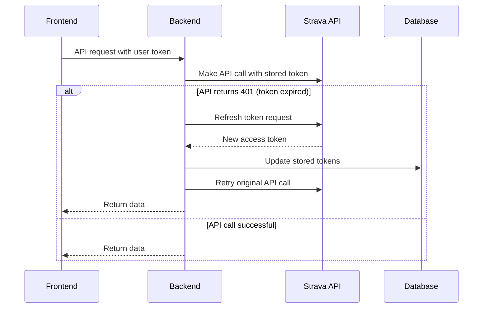

# Design Document

## Overview

Bodda is a full-stack web application consisting of a React frontend and Go backend that provides AI-powered coaching for runners and cyclists. The system integrates with Strava for activity data and OpenAI for intelligent coaching responses. The architecture supports real-time streaming responses, persistent conversation history, and an evolving athlete logbook system.

## Architecture

### High-Level Architecture



### Technology Stack

**Frontend:**
- React 18 with TypeScript
- Vite for build tooling
- Tailwind CSS for styling
- React Router for navigation
- WebSocket/SSE for real-time streaming
- Markdown rendering library (react-markdown)

**Backend:**
- Go 1.21+
- Gin web framework
- PostgreSQL with pgx driver
- Strava API v3
- OpenAI API
- WebSocket/SSE support
- JWT for authentication

## Components and Interfaces

### Frontend Components

#### 1. Landing Page Component
- **Purpose:** Welcome users and initiate Strava OAuth
- **Props:** None
- **State:** Loading states, error handling
- **Features:** 
  - Disclaimer display
  - Prominent Strava connect button
  - Responsive design

#### 2. Chat Interface Component
- **Purpose:** Main coaching interaction area
- **Props:** sessionId, user context
- **State:** Messages, input text, streaming status
- **Features:**
  - Message input/send
  - Real-time message streaming
  - Markdown rendering
  - Auto-scroll to latest messages
  - Scrolls automatically if needed user or coach sends new message
  - Header with logout button for easy session termination

#### 3. Session Sidebar Component
- **Purpose:** Navigation between conversation sessions
- **Props:** userId, currentSessionId
- **State:** Session list, loading states
- **Features:**
  - Session list display
  - New session creation
  - Session selection
  - Session metadata (date, title)

### Backend Services

#### Service Responsibilities

**Auth Service:** Handles Strava OAuth flow, token management, and user session validation
**Chat Service:** Manages conversation sessions, message persistence, real-time streaming, and coordinates AI responses
**Strava Service:** Pure Strava API client - fetches data, handles rate limits, token refresh
**AI Service:** OpenAI integration and function calling orchestration - focused purely on AI interactions
**Logbook Service:** Athlete profile management, training insights storage, and logbook updates

#### 1. Authentication Service
```go
type AuthService interface {
    HandleStravaOAuth(code string) (*User, error)
    ValidateToken(token string) (*User, error)
    RefreshStravaToken(user *User) error
    LogoutUser(userID string) error
}
```

#### 2. Chat Service
```go
type ChatService interface {
    CreateSession(userID string) (*Session, error)
    GetSessions(userID string) ([]*Session, error)
    SendMessage(sessionID, userID, content string) (*Message, error)
    StreamResponse(sessionID string, response chan string) error
}
```

#### 3. Strava Service
```go
type StravaService interface {
    // Core Strava API interactions with automatic token refresh
    GetAthleteProfile(user *User) (*StravaAthlete, error)
    GetActivities(user *User, params ActivityParams) ([]*StravaActivity, error)
    GetActivityDetail(user *User, activityID int64) (*StravaActivityDetail, error)
    GetActivityStreams(user *User, activityID int64, streamTypes []string) (*StravaStreams, error)
    RefreshToken(refreshToken string) (*TokenResponse, error)
    
    // Internal method for handling token refresh automatically
    executeWithTokenRefresh(user *User, apiCall func(string) (interface{}, error)) (interface{}, error)
}
```

#### 4. AI Service
```go
type AIService interface {
    // Core AI interaction - processes user messages and streams responses
    // Handles all tool calling internally including multi-turn iterations
    ProcessMessage(context *MessageContext) (chan string, error)
}

type MessageContext struct {
    UserID              string
    SessionID           string
    Message             string
    ConversationHistory []*Message
    AthleteLogbook      *AthleteLogbook
}

// Internal tool execution methods (not exposed in interface):
// - executeStravaTools(userID string, toolCalls []ToolCall) ([]ToolResult, error)
// - executeLogbookTool(userID string, toolCall ToolCall) (*ToolResult, error)
// - processIterativeToolCalls(context *MessageContext, messages []Message) (chan string, error)
```

#### 5. Logbook Service
```go
type LogbookService interface {
    // Athlete logbook management
    GetLogbook(userID string) (*AthleteLogbook, error)
    UpdateLogbook(userID string, content string) error
    CreateInitialLogbook(userID string, stravaProfile *StravaAthlete) error
}
```

## Data Models

### Core Entities

#### User
```go
type User struct {
    ID           string    `json:"id" db:"id"`
    StravaID     int64     `json:"strava_id" db:"strava_id"`
    AccessToken  string    `json:"-" db:"access_token"`
    RefreshToken string    `json:"-" db:"refresh_token"`
    TokenExpiry  time.Time `json:"-" db:"token_expiry"`
    FirstName    string    `json:"first_name" db:"first_name"`
    LastName     string    `json:"last_name" db:"last_name"`
    CreatedAt    time.Time `json:"created_at" db:"created_at"`
    UpdatedAt    time.Time `json:"updated_at" db:"updated_at"`
}
```

#### Session
```go
type Session struct {
    ID        string    `json:"id" db:"id"`
    UserID    string    `json:"user_id" db:"user_id"`
    Title     string    `json:"title" db:"title"`
    CreatedAt time.Time `json:"created_at" db:"created_at"`
    UpdatedAt time.Time `json:"updated_at" db:"updated_at"`
}
```

#### Message
```go
type Message struct {
    ID        string    `json:"id" db:"id"`
    SessionID string    `json:"session_id" db:"session_id"`
    Role      string    `json:"role" db:"role"` // "user" or "assistant"
    Content   string    `json:"content" db:"content"`
    CreatedAt time.Time `json:"created_at" db:"created_at"`
}
```

#### AthleteLogbook
```go
type AthleteLogbook struct {
    ID        string    `json:"id" db:"id"`
    UserID    string    `json:"user_id" db:"user_id"`
    Content   string    `json:"content" db:"content"`
    UpdatedAt time.Time `json:"updated_at" db:"updated_at"`
}
```

### Database Schema

```sql
-- Users table
CREATE TABLE users (
    id UUID PRIMARY KEY DEFAULT gen_random_uuid(),
    strava_id BIGINT UNIQUE NOT NULL,
    access_token TEXT NOT NULL,
    refresh_token TEXT NOT NULL,
    token_expiry TIMESTAMP NOT NULL,
    first_name VARCHAR(255),
    last_name VARCHAR(255),
    created_at TIMESTAMP DEFAULT NOW(),
    updated_at TIMESTAMP DEFAULT NOW()
);

-- Sessions table
CREATE TABLE sessions (
    id UUID PRIMARY KEY DEFAULT gen_random_uuid(),
    user_id UUID REFERENCES users(id) ON DELETE CASCADE,
    title VARCHAR(255) NOT NULL,
    created_at TIMESTAMP DEFAULT NOW(),
    updated_at TIMESTAMP DEFAULT NOW()
);

-- Messages table
CREATE TABLE messages (
    id UUID PRIMARY KEY DEFAULT gen_random_uuid(),
    session_id UUID REFERENCES sessions(id) ON DELETE CASCADE,
    role VARCHAR(20) NOT NULL CHECK (role IN ('user', 'assistant')),
    content TEXT NOT NULL,
    created_at TIMESTAMP DEFAULT NOW()
);

-- Athlete logbooks table
CREATE TABLE athlete_logbooks (
    id UUID PRIMARY KEY DEFAULT gen_random_uuid(),
    user_id UUID REFERENCES users(id) ON DELETE CASCADE UNIQUE,
    content TEXT NOT NULL,
    updated_at TIMESTAMP DEFAULT NOW()
);
```

## API Endpoints

### Authentication
- `GET /auth/strava` - Initiate Strava OAuth
- `GET /auth/callback` - Handle OAuth callback
- `POST /auth/logout` - Logout user and clear session
- `GET /auth/check` - Check authentication status and refresh tokens if needed

### Sessions
- `GET /api/sessions` - Get user sessions
- `POST /api/sessions` - Create new session
- `GET /api/sessions/:id/messages` - Get session messages

### Chat
- `POST /api/sessions/:id/messages` - Send message
- `GET /api/sessions/:id/stream` - SSE endpoint for streaming responses

### AI Tools (OpenAI Function Calling)

#### Strava Data Tools
- `get-athlete-profile` - Fetch complete athlete profile data from Strava including zones, stats, and preferences
- `get-recent-activities` - Fetches the most recent activities for the authenticated athlete (configurable count)
- `get-activity-details` - Fetches detailed information about a specific activity using its ID
- `get-activity-streams` - Retrieves detailed time-series data streams from a Strava activity (heart rate, power, cadence, etc.)

#### Logbook Management Tool
- `update-athlete-logbook` - Update or create the athlete logbook with free-form string content structured by the LLM

#### Multi-Turn Tool Execution
The AI service supports iterative tool calling where each round of tool results can inform the next set of tool calls. This enables sophisticated analysis workflows such as:

1. **Progressive Data Gathering:** Get athlete profile → Get recent activities → Get detailed streams for specific workouts
2. **Contextual Analysis:** Analyze recent performance → Get historical data for comparison → Update logbook with insights
3. **Adaptive Coaching:** Assess current fitness → Get relevant training data → Provide personalized recommendations

#### Tool Implementation Details
```go
type StravaTools struct {
    GetAthleteProfile    func() (*AthleteProfile, error)
    GetRecentActivities  func(perPage int) ([]*Activity, error)
    GetActivityDetails   func(activityId int64) (*ActivityDetail, error)
    GetActivityStreams   func(id int64, types []string, resolution string) (*ActivityStreams, error)
}

type LogbookTool struct {
    UpdateAthleteLogbook func(content string) error
}

type IterativeProcessor struct {
    MaxRounds        int                    // Maximum tool call rounds (default: 5)
    ProgressCallback func(string)          // Stream progress updates
    ToolResults      [][]ToolResult        // Results from each round
    Context          *MessageContext       // Persistent context
}

// IterativeProcessor Workflow:
// 1. Initial AI response may contain tool calls
// 2. Execute all tool calls in parallel for round 1
// 3. Add tool results to conversation context
// 4. Send updated context back to AI for analysis
// 5. AI can either:
//    - Generate more tool calls (start next round)
//    - Provide final response to user
// 6. Repeat until AI provides final response or max rounds reached
// 7. Stream progress updates at each step ("Analyzing activities...", "Getting detailed data...")

// Example Multi-Turn Flow:
// Round 1: AI calls get-athlete-profile, get-recent-activities
// → Results show user is a runner with recent tempo runs
// Round 2: AI calls get-activity-details for specific tempo runs
// → Results show heart rate zones and pacing data
// Round 3: AI calls get-activity-streams for detailed analysis
// → Results show power/pace correlation
// Round 4: AI calls update-athlete-logbook with insights
// → Final response with comprehensive coaching advice
```

## Multi-Turn Tool Calling Architecture

### Iterative Processing Flow



### Implementation Strategy

**Iterative Context Management:**
- Maintain conversation state across tool call rounds
- Accumulate tool results for comprehensive analysis
- Track tool call depth to prevent infinite loops
- Stream progress updates during long analysis chains

**Tool Call Orchestration:**
- Maximum 5 rounds of tool calls per user message
- Each round can contain multiple parallel tool calls
- Results from previous rounds inform subsequent tool selection
- Graceful degradation when tool calls fail mid-iteration

**Progress Streaming:**
- Stream intermediate updates like "Analyzing your recent activities..."
- Provide context about what data is being gathered
- Show progress through complex analysis workflows
- Maintain user engagement during longer processing times

## Error Handling

### Frontend Error Handling
- Network errors with retry mechanisms
- Authentication failures with redirect to login
- Streaming connection errors with reconnection
- User-friendly error messages for all failure scenarios
- Progress indication during multi-turn tool processing

### Backend Error Handling
- Structured error responses with consistent format
- Strava API rate limiting and token refresh
- OpenAI API failures with fallback responses
- Database connection and query error handling
- Graceful degradation when external services are unavailable
- Tool call iteration limits and timeout handling
- Partial result handling when some tool calls fail

### Error Response Format
```go
type ErrorResponse struct {
    Error   string `json:"error"`
    Message string `json:"message"`
    Code    int    `json:"code"`
}
```

## Testing Strategy

### Frontend Testing
- **Unit Tests:** Component logic, utility functions
- **Integration Tests:** API integration, routing
- **E2E Tests:** Critical user flows (OAuth, chat, session management)
- **Tools:** Jest, React Testing Library, Playwright

### Backend Testing
- **Unit Tests:** Service layer logic, data models
- **Integration Tests:** Database operations, external API calls
- **API Tests:** Endpoint behavior, authentication
- **Tools:** Go testing package, testify, httptest

### Test Data Management
- Mock Strava API responses for consistent testing
- Test database with sample user data
- AI service mocking for predictable responses
- Automated test data cleanup

## Token Management Architecture

### Automatic Token Refresh Strategy



### Token Refresh Implementation Details

**Reactive Refresh Strategy:**
- Handle 401 errors from Strava API calls automatically
- Attempt token refresh when authentication failures occur
- Retry original request with new tokens
- Update database with refreshed tokens immediately
- Log user out if refresh fails (invalid refresh token)
- Transparent to the user - they see a brief loading state during refresh

**Frontend Logout Flow:**
- Logout button in chat interface header
- Clear JWT tokens from browser storage
- Redirect to landing page
- Preserve user data (conversations, logbook) for future sessions

## Security Considerations

### Authentication & Authorization
- Secure storage of Strava tokens (encrypted at rest)
- JWT tokens for session management
- CORS configuration for frontend domain
- Rate limiting on API endpoints
- Automatic token refresh with secure retry logic

### Data Protection
- User data encryption in database
- Secure transmission (HTTPS only)
- Automatic reactive token refresh mechanism for Strava API
- Input validation and sanitization
- Secure logout with JWT token cleanup (preserves user data)

### AI Safety
- Content filtering for inappropriate responses
- Rate limiting on AI API calls
- Fallback responses for AI service failures
- User consent for data usage in AI training

## Performance Considerations

### Frontend Optimization
- Code splitting for route-based loading
- Lazy loading of chat history
- Optimistic UI updates for better UX
- Efficient re-rendering with React.memo

### Backend Optimization
- Database connection pooling
- Caching of Strava data (with appropriate TTL)
- Streaming responses to reduce perceived latency
- Background token refresh jobs

### Scalability Considerations
- Stateless backend design for horizontal scaling
- Database indexing on frequently queried fields
- CDN for static assets
- Load balancing preparation