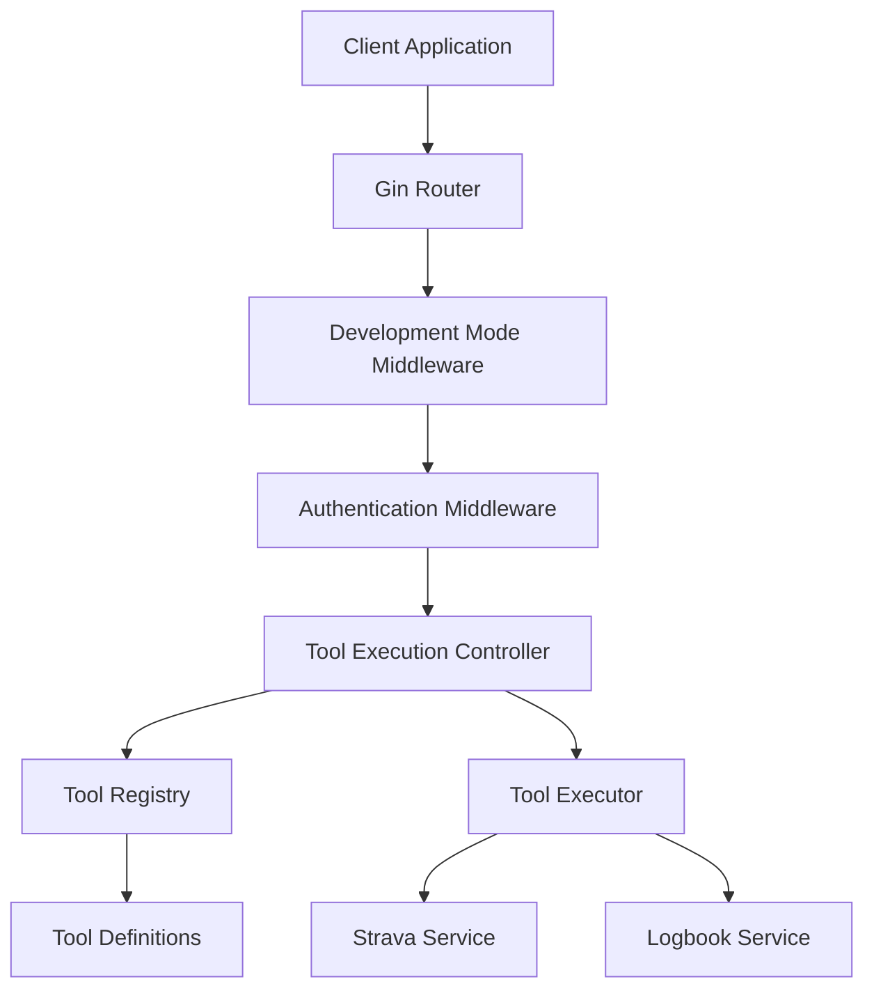

# Design Document

## Overview

The LLM Tool Execution Endpoint provides a flexible API that allows clients to execute any available tool with the same capabilities and behavior as an LLM would. This endpoint accepts tool specifications and parameters dynamically, returning structured results without requiring hardcoded tool implementations. The endpoint is development-only for security reasons and integrates seamlessly with the existing tool execution infrastructure.

The design leverages existing tool definitions and execution logic while providing comprehensive tool discovery, consistent response formats, robust error handling, and detailed monitoring capabilities. Key design principles include security-first development-only access, comprehensive input validation, and extensive logging for debugging and performance monitoring.

## Architecture

### High-Level Architecture



### Component Integration

The endpoint will integrate with existing services:
- **AI Service**: Reuse existing tool definitions and execution logic
- **Strava Service**: Execute Strava-related tools
- **Logbook Service**: Execute logbook-related tools
- **Authentication**: Use existing auth middleware
- **Configuration**: Use existing config system for development mode detection

## Components and Interfaces

### 1. Tool Registry

**Purpose**: Centralize tool definitions and provide discovery capabilities

```go
type ToolRegistry interface {
    GetAvailableTools() []ToolDefinition
    GetToolSchema(toolName string) (*ToolSchema, error)
    ValidateToolCall(toolName string, parameters map[string]interface{}) error
}

type ToolDefinition struct {
    Name        string                 `json:"name"`
    Description string                 `json:"description"`
    Parameters  map[string]interface{} `json:"parameters"`
    Examples    []ToolExample          `json:"examples,omitempty"`
}

type ToolSchema struct {
    Name        string                 `json:"name"`
    Description string                 `json:"description"`
    Parameters  map[string]interface{} `json:"parameters"`
    Required    []string               `json:"required"`
    Optional    []string               `json:"optional"`
    Examples    []ToolExample          `json:"examples"`
}

type ToolExample struct {
    Description string                 `json:"description"`
    Request     map[string]interface{} `json:"request"`
    Response    interface{}            `json:"response"`
}
```

### 2. Tool Executor

**Purpose**: Execute tools with proper context and error handling

```go
type ToolExecutor interface {
    ExecuteTool(ctx context.Context, toolName string, parameters map[string]interface{}, msgCtx *MessageContext) (*ToolExecutionResult, error)
}

type ToolExecutionResult struct {
    ToolName   string      `json:"tool_name"`
    Success    bool        `json:"success"`
    Data       interface{} `json:"data,omitempty"`
    Error      string      `json:"error,omitempty"`
    Duration   int64       `json:"duration_ms"`
    Timestamp  time.Time   `json:"timestamp"`
}
```

### 3. Tool Controller

**Purpose**: Handle HTTP requests and coordinate tool execution

```go
type ToolController struct {
    registry  ToolRegistry
    executor  ToolExecutor
    config    *config.Config
}

// HTTP Handlers
func (tc *ToolController) ListTools(c *gin.Context)
func (tc *ToolController) GetToolSchema(c *gin.Context)
func (tc *ToolController) ExecuteTool(c *gin.Context)
```

### 4. Development Mode Middleware

**Purpose**: Ensure endpoint is only available in development

```go
func DevelopmentOnlyMiddleware(config *config.Config) gin.HandlerFunc {
    return func(c *gin.Context) {
        if !config.IsDevelopment() {
            c.AbortWithStatus(404) // Return 404 as if endpoint doesn't exist
            return
        }
        c.Next()
    }
}
```

## Data Models

### Request/Response Models

```go
// Tool execution request
type ToolExecutionRequest struct {
    ToolName   string                 `json:"tool_name" binding:"required"`
    Parameters map[string]interface{} `json:"parameters"`
    Options    *ExecutionOptions      `json:"options,omitempty"`
}

type ExecutionOptions struct {
    Timeout         int  `json:"timeout_seconds,omitempty"`
    Streaming       bool `json:"streaming,omitempty"`
    BufferedOutput  bool `json:"buffered_output,omitempty"`
}

// Tool execution response
type ToolExecutionResponse struct {
    Status    string               `json:"status"`
    Result    *ToolExecutionResult `json:"result,omitempty"`
    Error     *ErrorDetails        `json:"error,omitempty"`
    Metadata  *ResponseMetadata    `json:"metadata,omitempty"`
}

type ErrorDetails struct {
    Code    string `json:"code"`
    Message string `json:"message"`
    Details string `json:"details,omitempty"`
}

type ResponseMetadata struct {
    RequestID string    `json:"request_id"`
    Timestamp time.Time `json:"timestamp"`
    Duration  int64     `json:"duration_ms"`
}

// Tool list response
type ToolListResponse struct {
    Tools []ToolDefinition `json:"tools"`
    Count int              `json:"count"`
}

// Tool schema response
type ToolSchemaResponse struct {
    Schema *ToolSchema `json:"schema"`
}
```

## Error Handling

### Error Categories

1. **Validation Errors** (400)
   - Invalid tool name
   - Missing required parameters
   - Invalid parameter types

2. **Authentication Errors** (401/403)
   - Missing authentication
   - Invalid token
   - Insufficient permissions

3. **Tool Execution Errors** (500)
   - Tool execution failure
   - Service unavailable
   - Timeout errors

4. **Development Mode Errors** (404)
   - Endpoint accessed in production (returns 404 as if endpoint doesn't exist)

### Error Response Format

```go
type ErrorResponse struct {
    Error struct {
        Code    string `json:"code"`
        Message string `json:"message"`
        Details string `json:"details,omitempty"`
    } `json:"error"`
    RequestID string    `json:"request_id"`
    Timestamp time.Time `json:"timestamp"`
}
```

## Testing Strategy

### Unit Tests

1. **Tool Registry Tests**
   - Tool definition validation
   - Schema generation with required/optional parameter indicators
   - Parameter validation against schemas
   - Example request/response validation

2. **Tool Executor Tests**
   - Tool execution with valid parameters
   - Error handling for invalid parameters
   - Context handling and workspace boundaries
   - Timeout handling and resource cleanup
   - Streaming vs buffered response modes

3. **Controller Tests**
   - HTTP request/response handling
   - Authentication integration
   - Development mode enforcement (404 in production)
   - Input sanitization and malicious parameter rejection

### Integration Tests

1. **End-to-End Tool Execution**
   - Execute each available tool with sample parameters
   - Verify response format consistency across all tools
   - Test error scenarios for each tool type
   - Validate streaming and buffered response modes

2. **Authentication Integration**
   - Valid token scenarios with proper user context
   - Invalid token scenarios
   - Missing authentication handling

3. **Development Mode Enforcement**
   - Endpoint availability in development mode
   - Endpoint returns 404 in production mode
   - Environment variable configuration testing

4. **Security Testing**
   - Malicious parameter injection attempts
   - File system boundary enforcement
   - SQL injection prevention
   - Path traversal prevention

### API Contract Tests

1. **OpenAPI Specification**
   - Generate OpenAPI spec from code
   - Validate request/response schemas
   - Test example requests from schema

2. **Response Format Consistency**
   - Consistent error formats across all failure scenarios
   - Consistent success formats across all tools
   - Metadata consistency (timestamps, request IDs, duration)

### Performance Tests

1. **Concurrent Execution**
   - Multiple tool executions simultaneously
   - Resource utilization monitoring
   - Queue status tracking

2. **Timeout Handling**
   - Tools that exceed configured timeouts
   - Graceful degradation under load

## Security Considerations

### Development-Only Access

- Endpoint completely disabled in production
- Returns 404 in production to hide existence
- Environment variable controls development mode

### Input Validation

- Strict parameter validation against tool schemas
- SQL injection prevention through parameterized queries
- Path traversal prevention for file system operations
- Input sanitization to reject malicious parameters
- Workspace boundary enforcement for file operations

### Authentication & Authorization

- Reuse existing JWT authentication
- User context validation
- Tool-specific permissions (future enhancement)

### Rate Limiting

- Implement rate limiting per user
- Prevent abuse of expensive operations
- Tool-specific rate limits

## Performance Considerations

### Caching

- Cache tool definitions
- Cache tool schemas
- Cache validation results

### Timeouts

- Configurable execution timeouts per tool
- Graceful timeout handling with appropriate status updates
- Resource cleanup on timeout
- Default and maximum timeout limits

### Resource Management

- Connection pooling for database operations
- Memory management for large responses
- Concurrent execution limits

## API Endpoints

### GET /api/tools

List all available tools with their basic information.

**Response**: `ToolListResponse`

**Design Rationale**: Changed from `/api/dev/tools` to `/api/tools` to match requirements. The development-only restriction is handled by middleware rather than URL path, making the API cleaner while maintaining security.

### GET /api/tools/{toolName}/schema

Get detailed schema for a specific tool including parameters and examples.

**Response**: `ToolSchemaResponse`

**Design Rationale**: Provides comprehensive tool discovery as required, including parameter schemas, required/optional field indicators, and usage examples.

### POST /api/tools/execute

Execute a tool with provided parameters.

**Request**: `ToolExecutionRequest`
**Response**: `ToolExecutionResponse`

**Design Rationale**: Core endpoint for dynamic tool execution. Supports both streaming and buffered response modes to handle different tool output patterns.

## Monitoring and Logging

### Execution Logging

**Purpose**: Track all tool executions for monitoring and debugging

```go
type ToolExecutionLog struct {
    RequestID    string                 `json:"request_id"`
    Timestamp    time.Time             `json:"timestamp"`
    UserID       string                `json:"user_id"`
    ToolName     string                `json:"tool_name"`
    Parameters   map[string]interface{} `json:"parameters"`
    Duration     int64                 `json:"duration_ms"`
    Success      bool                  `json:"success"`
    ErrorDetails string                `json:"error_details,omitempty"`
    StackTrace   string                `json:"stack_trace,omitempty"`
}
```

**Design Rationale**: Comprehensive logging enables debugging, performance monitoring, and audit trails. Sensitive parameters are redacted automatically.

### Performance Metrics

**Purpose**: Monitor system performance and resource utilization

```go
type PerformanceMetrics struct {
    ConcurrentExecutions int           `json:"concurrent_executions"`
    QueueDepth          int           `json:"queue_depth"`
    AverageExecutionTime float64      `json:"avg_execution_time_ms"`
    ResourceUtilization ResourceStats `json:"resource_utilization"`
    AlertThresholds     AlertConfig   `json:"alert_thresholds"`
}

type ResourceStats struct {
    CPUUsage    float64 `json:"cpu_usage_percent"`
    MemoryUsage int64   `json:"memory_usage_bytes"`
    ActiveConns int     `json:"active_connections"`
}
```

**Design Rationale**: Real-time metrics enable proactive monitoring and alerting when performance thresholds are exceeded.

### Alert System

- Performance threshold alerts (execution time, resource usage)
- Error rate monitoring and alerting
- Queue depth monitoring for bottleneck detection
- Integration with existing monitoring infrastructure

## Configuration

### Environment Variables

```bash
# Development mode (required for endpoint to be available)
DEVELOPMENT_MODE=true

# Tool execution settings
TOOL_EXECUTION_TIMEOUT=30
TOOL_MAX_TIMEOUT=300
TOOL_RATE_LIMIT_PER_MINUTE=60
TOOL_MAX_CONCURRENT_EXECUTIONS=5

# Monitoring and logging
TOOL_ENABLE_DETAILED_LOGGING=true
TOOL_PERFORMANCE_ALERT_THRESHOLD_MS=5000
TOOL_MAX_CPU_USAGE_PERCENT=80
TOOL_MAX_MEMORY_USAGE_MB=512
TOOL_MAX_QUEUE_DEPTH=10
```

### Config Structure Extension

```go
type Config struct {
    // ... existing fields ...
    
    // Development settings
    IsDevelopment bool
    
    // Tool execution settings
    ToolExecution ToolExecutionConfig
}

type ToolExecutionConfig struct {
    DefaultTimeout         int
    MaxTimeout            int
    RateLimitPerMinute    int
    MaxConcurrentExecs    int
    EnableCaching         bool
    CacheTTL             int
    EnableDetailedLogging bool
    PerformanceThresholds PerformanceThresholds
}

type PerformanceThresholds struct {
    MaxExecutionTimeMs int
    MaxCPUUsagePercent float64
    MaxMemoryUsageMB   int64
    MaxQueueDepth      int
}
```