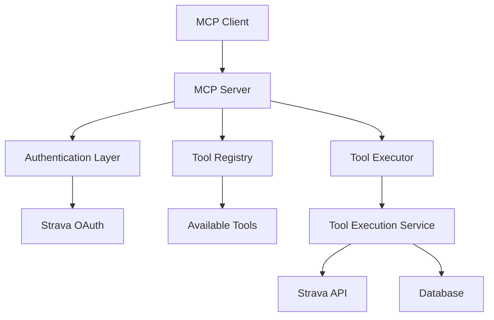

# Design Document

## Overview

The MCP Server Integration will expose Bodda's existing tool execution system as a remote Model Context Protocol (MCP) server. MCP is a protocol that enables AI applications to securely connect to external data sources and tools. This design leverages the existing ToolRegistry, ToolExecutor, and ToolController infrastructure while implementing the MCP protocol specification for standardized tool discovery and execution.

The MCP server will act as a bridge between MCP clients (like AI assistants) and Bodda's internal tool system, providing seamless access to Strava data analysis tools. MCP uses JSON-RPC 2.0 over various transports (stdio, WebSocket, SSE) and follows a client-server architecture where the server provides tools and resources.

## Research Findings

### MCP Protocol Specification

MCP (Model Context Protocol) is based on JSON-RPC 2.0 and supports:

1. **Transport Layers**: stdio, WebSocket, Server-Sent Events (SSE)
2. **Core Capabilities**: 
   - Tool discovery and execution
   - Resource access (files, databases, APIs)
   - Prompt templates
   - Logging and sampling
3. **Authentication**: Typically handled at the transport layer or through custom authentication flows
4. **Message Types**: Standard JSON-RPC 2.0 requests, responses, and notifications

### MCP Authentication Patterns

Research shows that MCP servers typically handle authentication in several ways:

1. **Transport-level Authentication**: Using API keys, OAuth tokens, or certificates at the connection level
2. **Session-based Authentication**: Establishing authenticated sessions that persist across multiple requests
3. **Per-request Authentication**: Including authentication context with each tool execution
4. **Proxy Authentication**: The MCP server acts as an authenticated proxy to external services

For Strava integration, the recommended pattern is **Proxy Authentication** where:
- The MCP server maintains Strava OAuth tokens
- Clients authenticate with the MCP server using API keys or session tokens
- The server uses stored Strava tokens to make API calls on behalf of authenticated users

## Architecture

### High-Level Architecture



### Component Architecture

The MCP server will be implemented as a new service that integrates with existing components:

1. **MCP Protocol Handler**: Implements the MCP specification for message handling
2. **Authentication Manager**: Handles MCP client authentication and Strava OAuth flows
3. **Tool Bridge**: Translates between MCP tool format and Bodda's internal tool format
4. **Session Manager**: Manages MCP client sessions and state
5. **Configuration Manager**: Handles MCP server configuration and settings

## Components and Interfaces

### MCP Server Interface

```go
type MCPServer interface {
    // Start starts the MCP server on the configured transport
    Start(ctx context.Context) error
    
    // Stop gracefully shuts down the MCP server
    Stop(ctx context.Context) error
    
    // HandleConnection handles a new MCP client connection
    HandleConnection(conn MCPConnection) error
}
```

### MCP Connection Interface

```go
type MCPConnection interface {
    // Send sends an MCP message to the client
    Send(message MCPMessage) error
    
    // Receive receives an MCP message from the client
    Receive() (MCPMessage, error)
    
    // Close closes the connection
    Close() error
    
    // GetClientInfo returns information about the connected client
    GetClientInfo() MCPClientInfo
}
```

### MCP Message Types

Following the MCP specification (JSON-RPC 2.0), the server will handle these core methods:

**Initialization:**
- `initialize`: Client capabilities negotiation
- `initialized`: Initialization completion notification

**Tool Operations:**
- `tools/list`: List available tools
- `tools/call`: Execute a specific tool

**Server Info:**
- `ping`: Health check
- `logging/setLevel`: Configure logging

```go
// JSON-RPC 2.0 Message Structure
type MCPMessage struct {
    JSONRPC string      `json:"jsonrpc"` // Always "2.0"
    ID      interface{} `json:"id,omitempty"`
    Method  string      `json:"method,omitempty"`
    Params  interface{} `json:"params,omitempty"`
    Result  interface{} `json:"result,omitempty"`
    Error   *MCPError   `json:"error,omitempty"`
}

type MCPError struct {
    Code    int         `json:"code"`
    Message string      `json:"message"`
    Data    interface{} `json:"data,omitempty"`
}

// MCP-specific structures
type MCPInitializeParams struct {
    ProtocolVersion string                 `json:"protocolVersion"`
    Capabilities    MCPClientCapabilities  `json:"capabilities"`
    ClientInfo      MCPImplementationInfo  `json:"clientInfo"`
}

type MCPServerCapabilities struct {
    Tools     *MCPToolsCapability     `json:"tools,omitempty"`
    Logging   *MCPLoggingCapability   `json:"logging,omitempty"`
}

type MCPToolsCapability struct {
    ListChanged bool `json:"listChanged,omitempty"`
}
```

### Tool Bridge Interface

```go
type ToolBridge interface {
    // ConvertToMCPTools converts internal tools to MCP tool format
    ConvertToMCPTools(tools []models.ToolDefinition) []MCPTool
    
    // ConvertFromMCPCall converts MCP tool call to internal format
    ConvertFromMCPCall(call MCPToolCall) (*models.ToolExecutionRequest, error)
    
    // ConvertToMCPResult converts internal result to MCP format
    ConvertToMCPResult(result *models.ToolExecutionResult) MCPToolResult
}
```

### Authentication Manager Interface

```go
type AuthenticationManager interface {
    // AuthenticateClient authenticates an MCP client
    AuthenticateClient(clientInfo MCPClientInfo) (*AuthenticatedClient, error)
    
    // GetStravaAuthURL generates Strava OAuth URL for client
    GetStravaAuthURL(clientID string) (string, error)
    
    // HandleStravaCallback processes Strava OAuth callback
    HandleStravaCallback(clientID, code string) error
    
    // ValidateStravaAccess validates client has valid Strava access
    ValidateStravaAccess(clientID string) error
}
```

## Data Models

### MCP Tool Format

Based on MCP specification, tools follow this structure:

```go
type MCPTool struct {
    Name        string                 `json:"name"`
    Description string                 `json:"description"`
    InputSchema MCPToolInputSchema     `json:"inputSchema"`
}

type MCPToolInputSchema struct {
    Type       string                            `json:"type"`
    Properties map[string]MCPSchemaProperty     `json:"properties,omitempty"`
    Required   []string                         `json:"required,omitempty"`
}

type MCPSchemaProperty struct {
    Type        string      `json:"type"`
    Description string      `json:"description,omitempty"`
    Default     interface{} `json:"default,omitempty"`
    Enum        []string    `json:"enum,omitempty"`
}

type MCPToolCallParams struct {
    Name      string                 `json:"name"`
    Arguments map[string]interface{} `json:"arguments,omitempty"`
}

type MCPToolResult struct {
    Content []MCPContent `json:"content"`
    IsError bool         `json:"isError,omitempty"`
}

type MCPContent struct {
    Type     string `json:"type"`
    Text     string `json:"text,omitempty"`
    Data     string `json:"data,omitempty"`
    MimeType string `json:"mimeType,omitempty"`
}
```

### Client Session Management

```go
type MCPClientSession struct {
    ID              string
    ClientInfo      MCPClientInfo
    AuthenticatedAt time.Time
    StravaToken     *StravaTokenInfo
    LastActivity    time.Time
    ActiveTools     map[string]bool
}

type StravaTokenInfo struct {
    AccessToken  string
    RefreshToken string
    ExpiresAt    time.Time
    AthleteID    int64
}
```

## Error Handling

### MCP Error Codes

The server will implement standard MCP error codes plus custom codes for Bodda-specific errors:

```go
const (
    // Standard MCP error codes
    MCPErrorParseError     = -32700
    MCPErrorInvalidRequest = -32600
    MCPErrorMethodNotFound = -32601
    MCPErrorInvalidParams  = -32602
    MCPErrorInternalError  = -32603
    
    // Custom Bodda error codes
    MCPErrorAuthRequired      = -32000
    MCPErrorStravaAuthFailed  = -32001
    MCPErrorToolNotFound      = -32002
    MCPErrorToolExecutionFailed = -32003
    MCPErrorRateLimitExceeded = -32004
)
```

### Error Mapping

The server will map internal tool execution errors to appropriate MCP error responses:

```go
type ErrorMapper interface {
    MapToMCPError(err error) *MCPError
}
```

## Testing Strategy

### Unit Tests

1. **MCP Protocol Handler Tests**
   - Message parsing and validation
   - Response formatting
   - Error handling

2. **Tool Bridge Tests**
   - Tool format conversion
   - Parameter validation
   - Result transformation

3. **Authentication Manager Tests**
   - Client authentication flows
   - Strava OAuth integration
   - Token management

### Integration Tests

1. **End-to-End MCP Flow Tests**
   - Client connection and authentication
   - Tool discovery and execution
   - Error scenarios

2. **Strava Integration Tests**
   - OAuth flow completion
   - Tool execution with Strava data
   - Token refresh handling

### Performance Tests

1. **Concurrent Client Tests**
   - Multiple simultaneous connections
   - Tool execution under load
   - Resource cleanup

2. **Long-Running Connection Tests**
   - Connection stability
   - Memory leak detection
   - Graceful shutdown

## Implementation Phases

### Phase 1: Core MCP Protocol Implementation
- Basic MCP message handling
- Tool discovery endpoint
- Simple tool execution

### Phase 2: Authentication Integration
- MCP client authentication
- Strava OAuth flow investigation and implementation
- Session management

### Phase 3: Advanced Features
- Error handling and recovery
- Performance optimization
- Monitoring and logging

### Phase 4: Production Readiness
- Security hardening
- Configuration management
- Documentation and examples

## Configuration

### Server Configuration

```go
type MCPServerConfig struct {
    // Server settings
    Host string `json:"host"`
    Port int    `json:"port"`
    Path string `json:"path"` // "/mcp" endpoint path
    
    // Protocol settings
    ProtocolVersion string `json:"protocol_version"` // "2024-11-05"
    Transport       string `json:"transport"`        // "websocket", "sse", "stdio"
    
    // Authentication settings
    RequireAuth bool   `json:"require_auth"`
    AuthMethod  string `json:"auth_method"` // "none", "token", "oauth"
    
    // Strava integration
    StravaClientID     string `json:"strava_client_id"`
    StravaClientSecret string `json:"strava_client_secret"`
    StravaRedirectURL  string `json:"strava_redirect_url"`
    
    // Rate limiting
    RateLimit struct {
        RequestsPerMinute int `json:"requests_per_minute"`
        BurstSize         int `json:"burst_size"`
    } `json:"rate_limit"`
    
    // Timeouts
    ConnectionTimeout time.Duration `json:"connection_timeout"`
    ExecutionTimeout  time.Duration `json:"execution_timeout"`
}
```

### Environment Variables

- `MCP_SERVER_HOST`: Server host (default: "localhost")
- `MCP_SERVER_PORT`: Server port (default: 8080)
- `MCP_SERVER_PATH`: Server endpoint path (default: "/mcp")
- `MCP_TRANSPORT`: Transport method (default: "websocket", options: "websocket", "sse", "stdio")
- `MCP_PROTOCOL_VERSION`: MCP protocol version (default: "2024-11-05")
- `MCP_REQUIRE_AUTH`: Require client authentication (default: true)
- `STRAVA_CLIENT_ID`: Strava OAuth client ID
- `STRAVA_CLIENT_SECRET`: Strava OAuth client secret
- `STRAVA_REDIRECT_URL`: Strava OAuth redirect URL

## Security Considerations

### Authentication Flow for Remote MCP Servers

Based on research into MCP authentication patterns and Strava OAuth requirements, the following approach will be implemented:

**MCP Client Authentication:**
1. **API Key Authentication**: Clients authenticate with the MCP server using API keys
2. **Session Management**: Authenticated clients receive session tokens for subsequent requests
3. **Transport Security**: All connections use TLS/WSS for secure communication

**Strava OAuth Proxy Pattern:**
1. **OAuth Initiation**: MCP server provides a Strava OAuth URL for user authentication
2. **Token Storage**: Server securely stores Strava access/refresh tokens per user
3. **Proxy Execution**: Server uses stored tokens to make Strava API calls on behalf of users
4. **Token Refresh**: Automatic refresh of expired Strava tokens

**Authentication Flow:**
```
1. MCP Client → MCP Server: Authenticate with API key
2. MCP Server → MCP Client: Return session token
3. MCP Client → MCP Server: Request Strava auth URL
4. MCP Server → MCP Client: Return OAuth URL
5. User → Strava: Complete OAuth flow
6. Strava → MCP Server: OAuth callback with tokens
7. MCP Client → MCP Server: Execute tools (using stored tokens)
```

### Security Measures

1. **Transport Security**: Use TLS for all connections
2. **Input Validation**: Validate all MCP messages and tool parameters
3. **Rate Limiting**: Implement per-client rate limiting
4. **Audit Logging**: Log all client actions and tool executions
5. **Token Encryption**: Encrypt stored Strava tokens
6. **Session Management**: Implement secure session handling with timeouts

## Monitoring and Observability

### Metrics

- Active MCP connections
- Tool execution rates and latencies
- Authentication success/failure rates
- Error rates by type
- Resource usage (memory, CPU)

### Logging

- Client connection events
- Tool execution requests and results
- Authentication events
- Error conditions
- Performance metrics

### Health Checks

- MCP server responsiveness
- Database connectivity
- Strava API availability
- Tool registry health