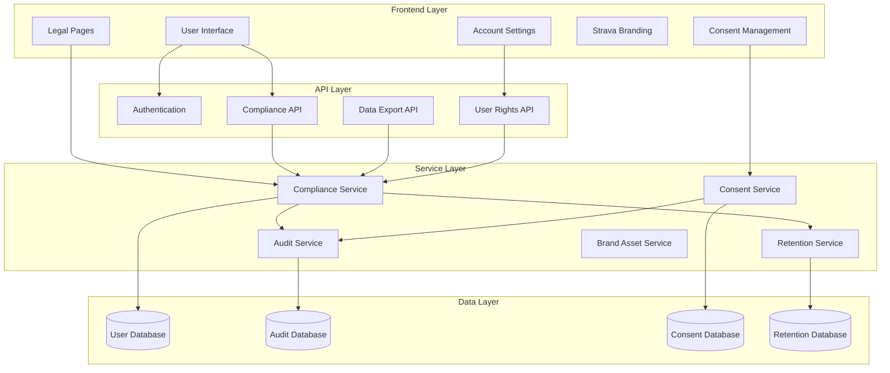

# Strava API Compliance Design

## Overview

This design implements comprehensive Strava API compliance including legal documentation, brand guideline adherence, data privacy controls, user rights management, and technical compliance monitoring. The architecture ensures scalable compliance while maintaining good user experience.

## Architecture

### Component Architecture



### Components and Interfaces

#### Frontend Components

**Legal Documentation Components**
- `LegalFooter` - Displays links to all legal pages with proper styling
- `PrivacyPolicy` - Comprehensive privacy policy page with Strava-specific sections
- `TermsOfService` - Terms of service including Strava data usage terms
- `LegalPageLayout` - Consistent layout for all legal documentation

**Strava Branding Components**
- `StravaAttribution` - Official "Powered by Strava" attribution with logo
- `StravaBrandAssets` - Centralized brand asset management
- `StravaLogoVariants` - Different logo variants for different contexts
- `BrandCompliantWrapper` - Ensures proper branding on Strava data displays

**Consent and Privacy Components**
- `ConsentModal` - Pre-OAuth consent collection with clear explanations
- `ConsentManagement` - Granular consent control interface
- `PrivacySettings` - User privacy preference management
- `DataUsageExplanation` - Clear explanation of how Strava data is used

**User Rights Components**
- `AccountSettings` - Comprehensive account management interface
- `DataExportRequest` - Data export request and download interface
- `AccountDeletion` - Account deletion workflow with confirmations
- `ConsentHistory` - Historical view of consent grants and revocations

#### Backend Services

**ComplianceService Interface**
```go
type ComplianceService interface {
    // Legal compliance
    ValidateUserConsent(ctx context.Context, userID string, consentType string) error
    RecordConsentGrant(ctx context.Context, userID string, consent ConsentRecord) error
    RecordConsentRevocation(ctx context.Context, userID string, consentType string) error
    
    // Data management
    ExportUserData(ctx context.Context, userID string) (*UserDataExport, error)
    DeleteUserData(ctx context.Context, userID string) error
    ApplyRetentionPolicies(ctx context.Context) error
    
    // Privacy enforcement
    FilterPrivateData(ctx context.Context, userID string, data interface{}) interface{}
    CheckDataAccessPermissions(ctx context.Context, userID string, dataType string) error
    
    // Audit and monitoring
    LogComplianceEvent(ctx context.Context, event ComplianceEvent) error
    GenerateComplianceReport(ctx context.Context, period TimePeriod) (*ComplianceReport, error)
}
```

**BrandComplianceService Interface**
```go
type BrandComplianceService interface {
    // Brand asset management
    GetStravaLogo(variant string, size string) (*BrandAsset, error)
    ValidateBrandUsage(ctx context.Context, usage BrandUsage) error
    GetAttributionRequirements(dataType string) (*AttributionRequirements, error)
    
    // Brand compliance checking
    ValidateLogoPlacement(ctx context.Context, placement LogoPlacement) error
    CheckColorCompliance(color string) error
    ValidateAttributionText(text string) error
}
```

### Data Models

#### Consent Management
```go
type ConsentRecord struct {
    ID          string    `json:"id"`
    UserID      string    `json:"user_id"`
    ConsentType string    `json:"consent_type"`
    Granted     bool      `json:"granted"`
    GrantedAt   time.Time `json:"granted_at"`
    RevokedAt   *time.Time `json:"revoked_at,omitempty"`
    Scope       []string  `json:"scope"`
    IPAddress   string    `json:"ip_address"`
    UserAgent   string    `json:"user_agent"`
    CreatedAt   time.Time `json:"created_at"`
}

type ConsentType string
const (
    ConsentStravaData     ConsentType = "strava_data"
    ConsentDataProcessing ConsentType = "data_processing"
    ConsentMarketing      ConsentType = "marketing"
    ConsentAnalytics      ConsentType = "analytics"
)
```

#### Brand Compliance
```go
type BrandAsset struct {
    ID       string `json:"id"`
    Type     string `json:"type"` // logo, icon, wordmark
    Variant  string `json:"variant"` // orange, white, black
    Format   string `json:"format"` // svg, png, jpg
    Size     string `json:"size"` // small, medium, large
    URL      string `json:"url"`
    MinWidth int    `json:"min_width"`
    MinHeight int   `json:"min_height"`
}

type AttributionRequirements struct {
    Required     bool     `json:"required"`
    Text         string   `json:"text"`
    LogoRequired bool     `json:"logo_required"`
    LinkRequired bool     `json:"link_required"`
    Placement    []string `json:"placement"` // footer, inline, badge
}
```

#### Audit and Compliance
```go
type ComplianceEvent struct {
    ID        string                 `json:"id"`
    UserID    *string               `json:"user_id,omitempty"`
    EventType string                `json:"event_type"`
    Action    string                `json:"action"`
    Details   map[string]interface{} `json:"details"`
    IPAddress string                `json:"ip_address"`
    UserAgent string                `json:"user_agent"`
    Timestamp time.Time             `json:"timestamp"`
}

type DataRetentionPolicy struct {
    DataType        string        `json:"data_type"`
    RetentionPeriod time.Duration `json:"retention_period"`
    AutoDelete      bool          `json:"auto_delete"`
    ArchiveFirst    bool          `json:"archive_first"`
}
```

### Database Schema

#### Enhanced Compliance Tables
```sql
-- User consent tracking with detailed scope
CREATE TABLE user_consents (
    id UUID PRIMARY KEY DEFAULT gen_random_uuid(),
    user_id UUID REFERENCES users(id) ON DELETE CASCADE,
    consent_type VARCHAR(50) NOT NULL,
    granted BOOLEAN NOT NULL,
    scope JSONB NOT NULL DEFAULT '[]',
    granted_at TIMESTAMP WITH TIME ZONE,
    revoked_at TIMESTAMP WITH TIME ZONE,
    ip_address INET,
    user_agent TEXT,
    created_at TIMESTAMP WITH TIME ZONE DEFAULT NOW(),
    updated_at TIMESTAMP WITH TIME ZONE DEFAULT NOW(),
    
    INDEX idx_user_consents_user_id (user_id),
    INDEX idx_user_consents_type (consent_type),
    INDEX idx_user_consents_granted (granted)
);

-- Comprehensive audit log
CREATE TABLE compliance_audit (
    id UUID PRIMARY KEY DEFAULT gen_random_uuid(),
    user_id UUID REFERENCES users(id) ON DELETE SET NULL,
    event_type VARCHAR(50) NOT NULL,
    action VARCHAR(100) NOT NULL,
    details JSONB NOT NULL DEFAULT '{}',
    ip_address INET,
    user_agent TEXT,
    session_id VARCHAR(255),
    request_id VARCHAR(255),
    created_at TIMESTAMP WITH TIME ZONE DEFAULT NOW(),
    
    INDEX idx_compliance_audit_user_id (user_id),
    INDEX idx_compliance_audit_event_type (event_type),
    INDEX idx_compliance_audit_created_at (created_at),
    INDEX idx_compliance_audit_action (action)
);

-- Data retention and lifecycle management
CREATE TABLE data_retention (
    id UUID PRIMARY KEY DEFAULT gen_random_uuid(),
    user_id UUID REFERENCES users(id) ON DELETE CASCADE,
    data_type VARCHAR(50) NOT NULL,
    data_identifier VARCHAR(255),
    last_accessed TIMESTAMP WITH TIME ZONE,
    retention_until TIMESTAMP WITH TIME ZONE NOT NULL,
    auto_delete BOOLEAN DEFAULT true,
    archived BOOLEAN DEFAULT false,
    archived_at TIMESTAMP WITH TIME ZONE,
    created_at TIMESTAMP WITH TIME ZONE DEFAULT NOW(),
    
    INDEX idx_data_retention_user_id (user_id),
    INDEX idx_data_retention_type (data_type),
    INDEX idx_data_retention_until (retention_until),
    INDEX idx_data_retention_auto_delete (auto_delete)
);

-- Brand compliance tracking
CREATE TABLE brand_usage_log (
    id UUID PRIMARY KEY DEFAULT gen_random_uuid(),
    user_id UUID REFERENCES users(id) ON DELETE SET NULL,
    brand_asset_id VARCHAR(100) NOT NULL,
    usage_context VARCHAR(100) NOT NULL,
    page_url TEXT,
    compliant BOOLEAN NOT NULL,
    validation_details JSONB,
    created_at TIMESTAMP WITH TIME ZONE DEFAULT NOW(),
    
    INDEX idx_brand_usage_user_id (user_id),
    INDEX idx_brand_usage_asset_id (brand_asset_id),
    INDEX idx_brand_usage_compliant (compliant)
);
```

### API Design

#### Compliance API Endpoints
```
POST   /api/v1/compliance/consent          # Grant/update consent
DELETE /api/v1/compliance/consent/:type    # Revoke specific consent
GET    /api/v1/compliance/consent          # Get current consent status
GET    /api/v1/compliance/data-export      # Request data export
POST   /api/v1/compliance/data-export      # Generate data export
DELETE /api/v1/compliance/account          # Delete account and data
POST   /api/v1/compliance/strava/revoke    # Revoke Strava access
GET    /api/v1/compliance/audit            # Get user audit log
GET    /api/v1/compliance/retention        # Get data retention info
```

#### Brand Compliance API
```
GET    /api/v1/brand/assets                # Get available brand assets
GET    /api/v1/brand/attribution/:type     # Get attribution requirements
POST   /api/v1/brand/validate              # Validate brand usage
GET    /api/v1/brand/guidelines            # Get brand guidelines
```

### Error Handling

#### Compliance-Specific Errors
```go
type ComplianceError struct {
    Code    string `json:"code"`
    Message string `json:"message"`
    Details map[string]interface{} `json:"details,omitempty"`
}

const (
    ErrConsentRequired     = "CONSENT_REQUIRED"
    ErrConsentRevoked      = "CONSENT_REVOKED" 
    ErrDataRetentionExpired = "DATA_RETENTION_EXPIRED"
    ErrPrivacyViolation    = "PRIVACY_VIOLATION"
    ErrBrandViolation      = "BRAND_VIOLATION"
    ErrRateLimitExceeded   = "RATE_LIMIT_EXCEEDED"
)
```

### Testing Strategy

#### Compliance Testing
- **Legal Page Testing**: Verify all legal pages render correctly and contain required information
- **Consent Flow Testing**: Test consent collection, storage, and revocation workflows
- **Brand Compliance Testing**: Validate Strava branding appears correctly across all contexts
- **Data Export Testing**: Verify complete and accurate data export functionality
- **Account Deletion Testing**: Ensure complete data removal and proper confirmations

#### Security Testing
- **Privacy Enforcement Testing**: Verify private data filtering works correctly
- **Audit Log Testing**: Ensure all compliance events are properly logged
- **Token Security Testing**: Test Strava token handling and revocation
- **Data Encryption Testing**: Verify data encryption at rest and in transit

#### Performance Testing
- **Audit Log Performance**: Test audit logging doesn't impact application performance
- **Data Export Performance**: Test large data export generation and delivery
- **Retention Policy Performance**: Test automated data cleanup performance